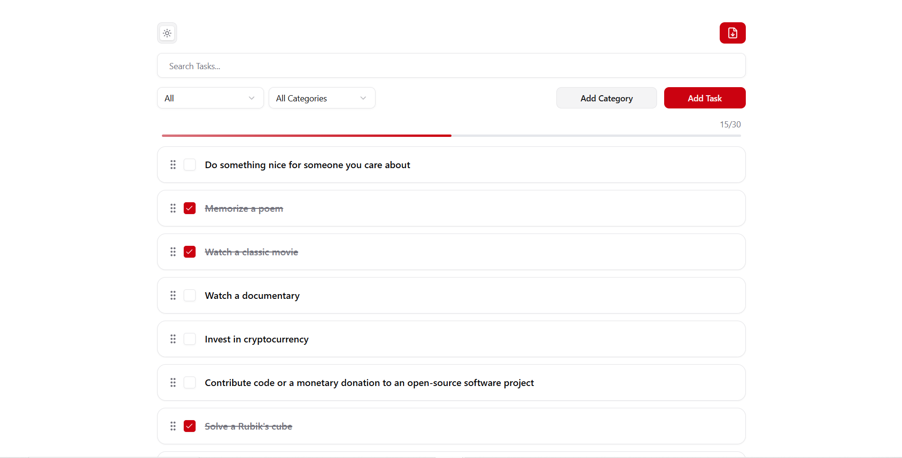
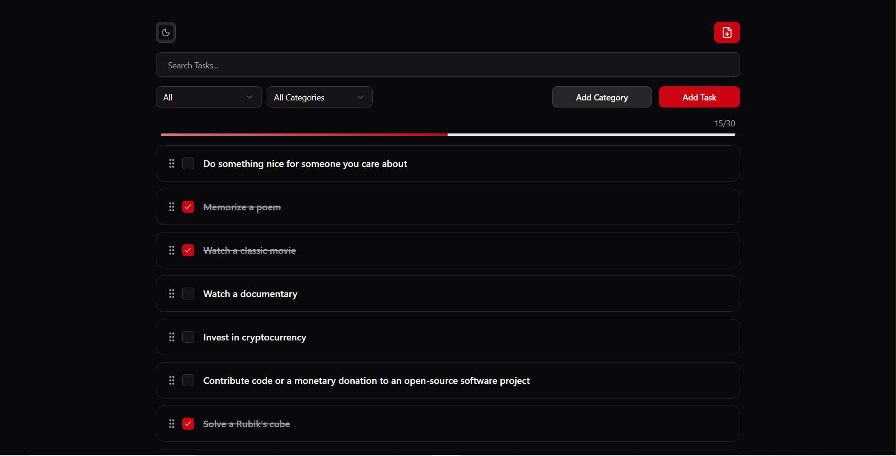
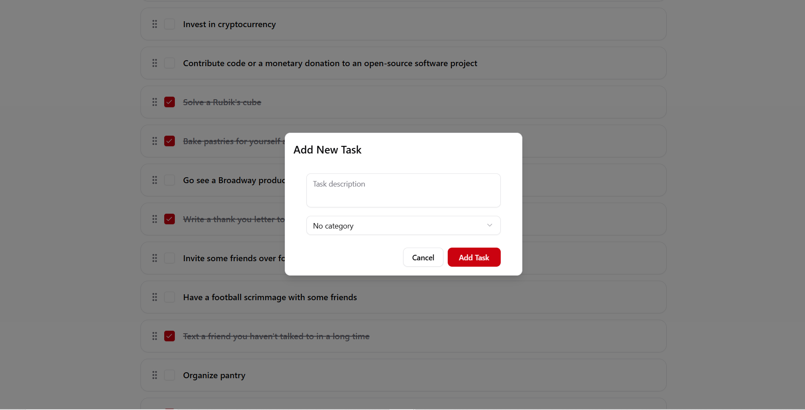
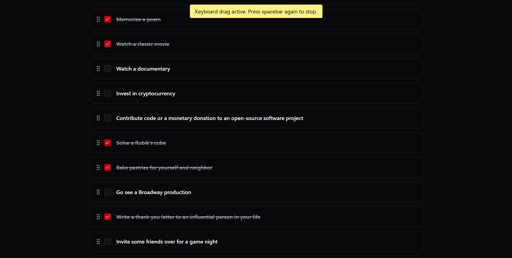
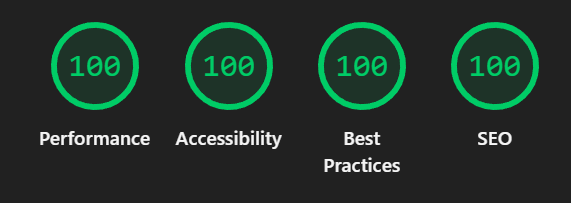

# Personal Task Manager

A modern, responsive Personal Task Manager built with React, Tailwind CSS, and integrated with DummyJSON API. This application allows users to efficiently manage their daily tasks with categories, drag & drop reordering, and theme toggling.

## Project Overview

The Personal Task Manager is designed to help users:

-   Add, edit, delete, and mark tasks as completed.
-   Organize tasks into color-coded categories.
-   Filter tasks by status or category.
-   Reorder tasks using drag & drop.
-   Persist categories and theme preferences locally.
-   Seamlessly switch between dark and light modes.
-   Work on mobile, tablet, and desktop devices.

This project demonstrates React development skills, Tailwind CSS proficiency, API integration capabilities, and attention to UI/UX design.

## Features

### Core Features

-   **Task Management**: Add, edit, delete, and complete tasks.
-   **API Integration**: CRUD operations using DummyJSON API.
-   **Filtering & Searching**: Search tasks by keyword, filter by status (All, Active, Completed) and categories.
-   **Drag & Drop**: Reorder tasks with visual feedback.
-   **Categories**: Add, remove, and assign color-coded categories.
-   **Theme Toggle**: Dark/Light mode with persistence using localStorage.
-   **Error Handling**: Graceful handling of API errors and network issues.
-   **Responsive Design**: Mobile-first layout with support for tablet and desktop.

### Bonus Features

-   Task completion statistics with a progress bar.
-   Export tasks to JSON.
-   Smooth animations and micro-interactions.

## Technology Stack

-   **React** (Functional Components & Hooks)
-   **Tailwind CSS**
-   **TypeScript**
-   **Axios** for API calls
-   **React Query** for asynchronous state management
-   **Dnd-kit** for drag & drop
-   **React Hot Toast** for notifications
-   **Vercel ** for deployment

## Installation

1.  **Clone the repository:**:
    ```bash
    git clone https://github.com/AhmedKhaledNasr74/bosta-frontend-task.git
    cd bosta-frontend-task
    ```
2.  **install dependencies:**:
    ```bash
    npm install
    # or
    yarn install
    ```
3.  **Start the development server:**:

    ```bash
    npm run dev
    # or
    yarn dev
    ```

4.  Open the app in your browser at http://localhost:5173 (Vite default port).

## Project Structure

src/  
 ├── apis/ # API service functions <br>
├── components/ # Reusable UI components (TaskCard, Modals, Selects)<br>
├── contexts/ # React context providers (Tasks, Categories, Theme)<br>
├── interfaces/ # TypeScript interfaces (Task, Category)<br>
├── pages/ # Main page components (TaskManagement)<br>
├── utils/ # Utility functions (export JSON)<br>
├── App.tsx # Root component<br>
└── main.tsx # Entry point<br>

## Usage

-   Add Task: Click "Add Task" → fill in description → assign category → submit.

-   Edit Task: Click the edit icon on a task → modify → save.

-   Delete Task: Click the trash icon on a task.

-   Toggle Completion: Use the checkbox to mark a task as completed.

-   **Drag & Drop**: Reorder tasks using different input methods:

    -   **Keyboard**: Focus on a task’s drag handle (grip) and press **Spacebar** to pick it up. Use the arrow keys to move it, and press **Spacebar** again to drop it. This allows enabling and disabling keyboard dragging dynamically.

    -   **Mouse**: Click and hold the task’s drag handle (grip) to drag it to a new position.

    -   **Phone / Touch**: Tap and hold the task’s drag handle (grip), then drag it to reorder.

-   Filter & Search: Use status/category dropdowns and search input.

-   Add Category: Click "Add Category" → fill in name and color → submit.

-   Theme Toggle: Use the Sun/Moon button to switch between light and dark modes.

-   Export Tasks: Click the export icon to download tasks as JSON.

## Screenshots

### Main Interface



### Dark Theme



### Add Task Modal



### keyboard drag and drop



### Lighthouse test



-   please disable all the extensions or run on incognito mode to see this result

## Known Limitations & Future Enhancements

-   Task due dates and reminders can be added.

-   Export to CSV.

## Personal Reflection

During this project, I focused on code structure, reactive state management, and intuitive UI/UX. Implementing drag & drop with Dnd-kit, combined with async API calls, Tailwind CSS allowed rapid prototyping with responsive and accessible design.

## Deployment

-   Live Demo: https://bosta-frontend-task.vercel.app/

-   GitHub Repository: https://github.com/AhmedKhaledNasr74/bosta-frontend-task

## Author

Ahmed Khaled
